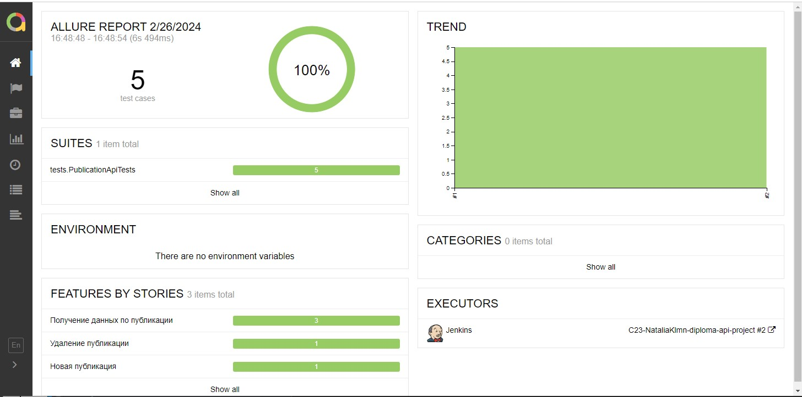
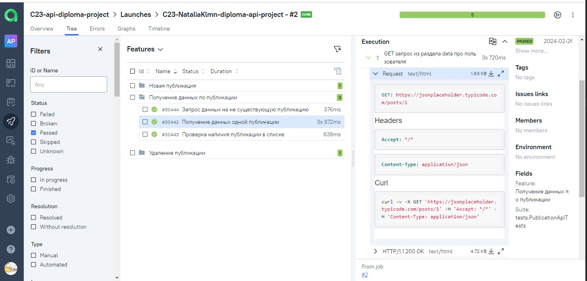
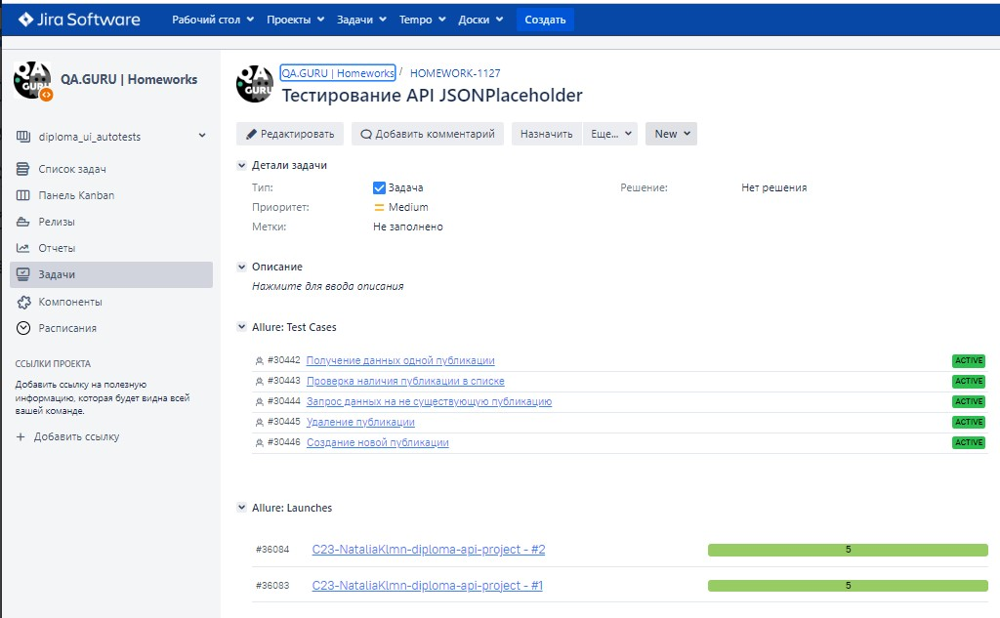

<h1 >Проект автоматизации тестирования API <a href="https://jsonplaceholder.typicode.com/">JSONPlaceholder</a></h1>

## Содержание

* <a href="#annotation">Описание</a>
* <a href="#tools">Технологии и инструменты</a>
* <a href="#cases">Автоматизированные проверки API</a>
* <a href="#console">Запуск тестов из терминала</a>
* <a href="#jenkins">Запуск тестов в Jenkins</a>
* <a href="#devops">Отчеты в Allure DevOps</a>
* <a href="#jira">Интеграция Jira</a>

<a id="annotation"></a>
## Описание
Тестовый проект состоит из веб-тестов (UI), тестов API и мобильных тестов (Android).\
Краткий список интересных фактов о проекте:
- [x] Возможность локального и удалённого запуска тестов
- [x] Использование `Lombok` для моделей в API тестах
- [x] Использование request/response спецификаций для API тестов
- [x] Custom Allure listener для API requests/responses логов
- [x] Автотесты оформлены как тестовая документация посредством аннотаций `Allure`

<a id="tools"></a>
## Технологии и инструменты

<div align="center">
<a href="https://www.jetbrains.com/idea/"></a>
<a href="https://github.com/"></a>  
<a href="https://www.java.com/"></a>
<a href="https://gradle.org/"></a>  
<a href="https://junit.org/junit5/"></a>
<a href="https://selenide.org/"></a>
<a href="https://rest-assured.io/"></a>
<a href="https://www.jenkins.io/"></a>
<a href="https://github.com/allure-framework/"></a>
</div>

Автотесты в этом проекте написаны на Java.\
<code>Gradle</code> — используется как инструмент автоматизации сборки.\
<code>JUnit5</code> — для выполнения тестов.\
<code>REST Assured</code> — для тестирования REST-API сервисов.\
<code>Jenkins</code> — CI/CD для запуска тестов удаленно.\
<code>Allure Report</code> — для визуализации результатов тестирования.\


<a id="cases"></a>
## Автоматизированные проверки API
- [x] Проверка получения данных по одной публикации

- [x] Проверка статуса и ответа при получении списка публикаций

- [x] Проверка статуса и ответа при неверном id публикации при удалении

- [x] Проверка статуса и ответа при успешном удалении публикации

- [x] Проверка статуса и ответа при добавлении публикации

<a id="console"></a>
##  Запуск тестов из терминала
### Локальный запуск тестов

```
gradle clean test  
```
<a id="jenkins"></a>
## Запуск тестов в [Jenkins](https://jenkins.autotests.cloud/job/C23-NataliaKlmn-diploma-api-project/)

<p align="center">

> Для запуска необходимо нажать "Собрать сейчас".

> При клике на сборку после завершения можно увидеть артефакты запуска и полезные ссылки для более детального изучения прогона.

<a href="https://jenkins.autotests.cloud/job/AD_demo_api_reqres/"></a>
</p>

<a id="devops"></a>
## </a> [Allure DevOps Report](https://jenkins.autotests.cloud/job/C23-NataliaKlmn-diploma-api-project/2/allure/) отчеты

<p align="center">

</p>

<a id="jira"></a>
## Интеграция с [Jira](https://jira.autotests.cloud/browse/HOMEWORK-1127)

<p align="center">

<p align="center">

</p>

